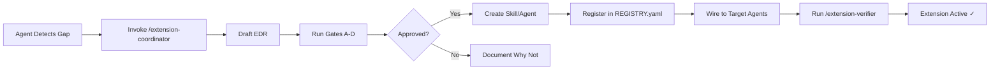

# JP Dynamic Agent System (v2)

**Self-extending agents that build agents and skills.**

A VS Code Copilot agent orchestration system with controlled self-extension capabilities. This system enables agents to detect workflow gaps during project execution and create new skills or agents through a governed approval process—ensuring quality, traceability, and safety.

[](LICENSE)
[](https://code.visualstudio.com/insiders/)

---

## 🎯 What Is This?

JP Dynamic Agent System (v2) is a **multi-agent orchestration framework** for VS Code that:

- Provides 7 specialized agents (Orchestrator, Researcher, Planner, Coder, Verifier, Debugger, Designer)
- Preserves your core workflow (P0 behavior) while enabling controlled extensions
- Detects when new capabilities are needed during active development
- Creates new skills/agents through a governed, documented process
- Maintains full audit trails and prevents speculative or undocumented changes

**Key Principle:** *Skill-first, agent-second.* The system prefers creating reusable skills over adding new agents, and requires explicit justification for both.

---

## ✨ Key Features

### 🛡️ Safety-First Design
- **Additive-only changes** — existing agent behavior is never modified, only extended
- **P0 invariants** — critical workflows are locked and regression-tested
- **Gate-based approval** — 4-gate decision process before any extension is created
- **Full audit trail** — every extension has an EDR (Extension Decision Record) in Git

### 🔄 Controlled Self-Extension
- **Automatic gap detection** during research, planning, and coding phases
- **Governed creation flow** — EDR → Gates A–D → Approval → Create → Wire → Verify
- **Registry-based tracking** — single source of truth for all skills and agents
- **Verification checklist** — ensures every extension completes the full governance loop

### 📦 Production-Ready
- Works with **VS Code Insiders** (February 2026+)
- Compatible with existing Copilot agent workflows
- Documented integration patterns for skills and agents
- Fallback strategies when optional tools are unavailable

---

## 🚀 Quick Start

### Prerequisites

- **VS Code Insiders** (latest version)
- **GitHub Copilot** subscription with agent/skill support enabled
- **Git** for version control and audit trails

### Installation

1. **Clone or copy the system to your repository:**

```bash
# Copy these folders to your project root:
.github/
  agents/           # 7 core agents
  skills/           # Governance skills (extension-coordinator, extension-verifier)

.planning/
  extensions/       # Governance system (EDR template, registry, rules)
  baseline/         # P0 safety checks and invariants
```

2. **Customize for your project:**

Edit `.planning/baseline/P0_INVARIANTS.yaml` to define your project's critical behaviors:

```yaml
invariants:
  - id: "YOUR-PROJECT-CORE-WORKFLOW"
    description: "What must never change in your project"
    verification: "How to check it's still true"
```

3. **Verify the setup:**

Open VS Code Chat and type:
```
/extension-verifier
```

You should see the skill appear in autocomplete. ✅

---

## 📖 How It Works

### Normal Agent Workflow

Use agents via VS Code Chat as usual:

```
@orchestrator Build a REST API with authentication
```

The Orchestrator delegates to:
- **Researcher** → gathers requirements and context
- **Planner** → creates phased execution plan
- **Coder** → implements features
- **Verifier** → validates correctness
- **Debugger** → fixes issues
- **Designer** → UI/UX guidance

### Self-Extension Workflow

When an agent detects a workflow gap (e.g., "We need a security audit checklist"), it triggers controlled extension:



**Decision Gates:**
- **Gate A:** Can an existing skill handle this? If yes → use it, don't create new
- **Gate B:** Is it a repeatable workflow? If yes → create **Skill**
- **Gate C:** Does it need distinct tool permissions/role? If yes → consider **Agent**
- **Gate D:** Will it reduce future friction? If yes → **Approve**

---

## 📁 Repository Structure

```
.github/
├── agents/                          # Core agent definitions
│   ├── orchestrator.agent.md       # Delegates, never implements
│   ├── researcher.agent.md         # Gathers context
│   ├── planner.agent.md            # Creates task plans
│   ├── coder.agent.md              # Implements features
│   ├── verifier.agent.md           # Validates work
│   ├── debugger.agent.md           # Fixes issues
│   └── designer.agent.md           # UI/UX guidance
│
└── skills/                          # Self-extension governance
    ├── extension-coordinator/       # Creates new skills/agents
    │   └── SKILL.md
    └── extension-verifier/          # Validates extension loop
        └── SKILL.md

.planning/
├── extensions/                      # Governance system
│   ├── EDR_TEMPLATE.md             # Template for proposing extensions
│   ├── REGISTRY.yaml               # Master list of all extensions
│   ├── DECISION_RULES.md           # Skill-first decision logic
│   ├── WIRING_CONTRACT.md          # How skills connect to agents
│   ├── ADDITIVE_ONLY.md            # Rules for safe updates
│   └── edr/                        # Approved Extension Decision Records
│       ├── EDR-20260218-0001-extension-coordinator.md
│       └── EDR-20260218-0002-extension-verifier.md
│
├── baseline/                        # P0 safety system
│   ├── P0_INVARIANTS.yaml          # Critical behaviors to preserve
│   ├── CHANGE_GATES.md             # Approval rules
│   └── TOOL_FALLBACKS.md           # Fallback strategies
│
├── research/                        # System documentation
│   ├── SUMMARY.md                  # Executive overview
│   └── ARCHITECTURE.md             # How agents interact
│
├── REQUIREMENTS.md                  # System guarantees
├── ROADMAP.md                       # Build phases
└── INTEGRATION.md                   # Cross-phase verification
```

---

## 💡 Usage Examples

### Example 1: Creating a New Skill

You're building a web API and need API documentation generation:

```
@coder Add OpenAPI documentation generation

# Coder detects: "No skill exists for API doc generation"
# System triggers: /extension-coordinator

# Flow:
1. EDR drafted: .planning/extensions/edr/EDR-20260218-0003-api-docs.md
2. Gates run:
   - Gate A: No existing skill ✓
   - Gate B: Repeatable workflow ✓
   - Gate C: No new agent needed (Coder can use it) ✓
   - Gate D: Reduces future friction ✓
3. Skill created: .github/skills/api-docs/SKILL.md
4. Registry updated with wiring_targets: [Coder, Verifier]
5. Verification: /extension-verifier confirms loop complete
```

### Example 2: Using an Existing Extension

```
@verifier Run security audit on the authentication module

# Verifier checks REGISTRY.yaml
# Finds: ext-skill-security-audit (if you created it earlier)
# Invokes: /security-audit
# Produces: Verification report
```

### Example 3: Customizing Agent Behavior (Safely)

You want Coder to always run tests after implementation:

**❌ Wrong way:** Edit `.github/agents/coder.agent.md` directly (breaks P0)

**✅ Right way:**
1. Create a skill: `.github/skills/auto-test-runner/SKILL.md`
2. Go through EDR → Gates → Approval
3. System appends `## Extension Detection` section to Coder
4. P0 behavior preserved, testing added

---

## 🛡️ Safety Guarantees

### What the System Prevents

❌ Speculative skill/agent creation ("let's add this just in case")  
❌ Undocumented changes to agent behavior  
❌ Breaking existing workflows accidentally  
❌ Untracked extensions or permission escalations  

### What the System Ensures

✅ Every extension has explicit justification (EDR)  
✅ Decision gates enforce skill-first policy  
✅ All agent changes are additive-only  
✅ Full Git audit trail for traceability  
✅ P0 regression checks before approval  
✅ Wiring verification (skills reach intended agents)  

---

## 📋 Key Files Reference

| File | Purpose | When to Edit |
|------|---------|-------------|
| `REGISTRY.yaml` | Master list of all extensions | View to see what exists; system updates automatically |
| `EDR_TEMPLATE.md` | Template for proposing new skills/agents | Copy when proposing an extension |
| `DECISION_RULES.md` | Skill-first logic and gates | Rarely; only to change governance policy |
| `P0_INVARIANTS.yaml` | Your project's critical behaviors | At project start; define what must never change |
| `WIRING_CONTRACT.md` | How skills connect to agents | Reference when debugging wiring issues |

---

## 🔧 Advanced Configuration

### Customizing Decision Gates

Edit `.planning/extensions/DECISION_RULES.md` to adjust when skills/agents are created:

```markdown
## Custom Gate: Skill Complexity Threshold

Before Gate D, check:
- Will this skill exceed 200 lines? → Consider agent instead
- Does it need external API access? → Requires security review
```

### Adding Custom P0 Invariants

Edit `.planning/baseline/P0_INVARIANTS.yaml`:

```yaml
invariants:
  - id: "CUSTOM-DEPLOY-FLOW"
    description: "Deployment must always run tests first"
    anchor_text: "Never deploy without passing tests"
    files: [".github/agents/coder.agent.md"]
    verification: "grep 'run tests before deploy' .github/agents/coder.agent.md"
```

### Wiring Options

**Option A: Plan-driven (lightweight)**
- Reference skills in planning docs
- No agent file edits required
- Best for: one-time or phase-specific skills

**Option B: Agent-embedded (persistent)**
- Append skill references to agent files
- Skill always available to agent
- Best for: frequently-used, general-purpose skills

See `.planning/extensions/WIRING_CONTRACT.md` for details.

---

## 🧪 Verification & Testing

### Verify an Extension

After creating a skill/agent, run:

```
/extension-verifier [phase] [extension name] [EDR path] [wiring option A|B]
```

Example:
```
/extension-verifier 5 security-audit .planning/extensions/edr/EDR-20260218-0003-security-audit.md A
```

The verifier checks:
1. ✅ EDR exists and is approved
2. ✅ Registry entry is correct and active
3. ✅ Wiring evidence exists
4. ✅ P0 regression checks pass
5. ✅ Skill loads in VS Code

### Run P0 Smoke Checks

```powershell
# Check that core agent files are intact
Get-ChildItem .github/agents/*.agent.md | Select-String "NEVER implement anything yourself"

# Verify registry integrity
yq eval '.extensions[] | select(.status == "active")' .planning/extensions/REGISTRY.yaml
```

---

## 🤝 Contributing Extensions

Want to share a skill with the community?

1. **Create your skill locally** using the governed flow
2. **Document it thoroughly** in the SKILL.md
3. **Verify end-to-end** with `/extension-verifier`
4. **Submit PR** with:
   - EDR document
   - SKILL.md file
   - Registry update
   - Verification evidence

See `CONTRIBUTING.md` for detailed guidelines.

---

## 📚 Documentation

- [Architecture Overview](.planning/research/ARCHITECTURE.md)
- [Requirements & Guarantees](.planning/REQUIREMENTS.md)
- [Build Roadmap](.planning/ROADMAP.md)
- [Extension Decision Rules](.planning/extensions/DECISION_RULES.md)
- [Wiring Contract](.planning/extensions/WIRING_CONTRACT.md)

---

## 🐛 Troubleshooting

### Skill not appearing in autocomplete

1. Check `.github/skills/<name>/SKILL.md` exists
2. Verify frontmatter has `user-invokable: true`
3. Reload VS Code window (Cmd/Ctrl+Shift+P → "Reload Window")
4. Check Output → "Chat customization Diagnostics" for errors

### EDR approval failing

1. Ensure all Gates A–D have clear PASS/NO verdicts
2. Check `status: approved` in EDR frontmatter
3. Verify `approved_by` field is populated
4. Confirm EDR path matches registry `edr` field

### Agent not using a skill

1. Check `REGISTRY.yaml` → `wiring_targets` includes the agent
2. For Option B wiring, verify agent file has `## Extension Detection` section
3. For Option A wiring, verify planning doc references the skill
4. Run `/extension-verifier` to validate wiring

### P0 regression detected

1. Review `.planning/baseline/P0_INVARIANTS.yaml`
2. Check what changed: `git diff HEAD~1 .github/agents/`
3. If additive section caused it, revise to be more isolated
4. Run smoke checks: see `.planning/phases/4/P0_SMOKE_CHECKS.md`

---

## 🗺️ Roadmap

- [x] Phase 1: Baseline planning + risk gates
- [x] Phase 2: Governance for controlled self-extension
- [x] Phase 3: Additive integration of extension flow
- [x] Phase 4: Pilot extension + hardening
- [ ] Phase 5: Community skill marketplace
- [ ] Phase 6: Cross-repo skill sharing
- [ ] Phase 7: Automated gate validation tooling

---

## 📄 License

MIT License - see [LICENSE](LICENSE) file for details.

Built for VS Code Insiders and GitHub Copilot.

---

## 🙏 Acknowledgments

This system builds on the [JP Dynamic Agent System (v1)](https://gist.github.com/japperJ/cdeaa98b5d7dd612d525d73bdc456e28) and incorporates lessons from production agent orchestration workflows.

**Philosophy:** *Agents that extend themselves responsibly create more value than agents that stay static or grow chaotically.*

---

## 📞 Support

- **Issues:** [GitHub Issues](https://github.com/japperJ/JP-Dynamic-Agent-System--v2-/issues)
- **Discussions:** [GitHub Discussions](https://github.com/japperJ/JP-Dynamic-Agent-System--v2-/discussions)
- **Documentation:** See `.planning/research/` folder

---

**Ready to get started?** Copy the files, customize your P0 invariants, and let your agents safely extend themselves as your project grows. 🚀
